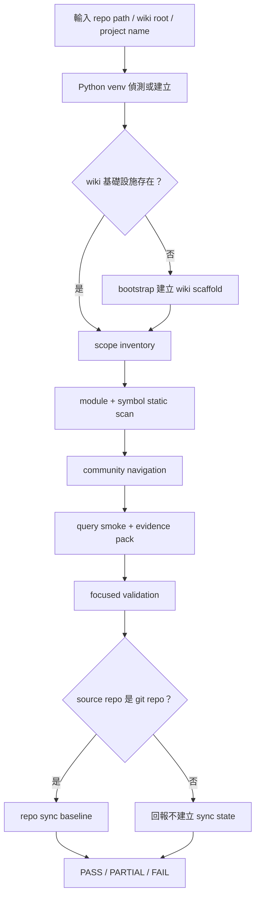

# LLM Wiki 提取流程技術說明

本文說明 `LLM Wiki Forge` 如何從一個原始碼 repo 提取出可供 LLM / AI Agent 使用的本機 Wiki。這裡的「提取」不是只把檔案轉成 Markdown，也不是單純做全文索引，而是把程式碼、模組邊界、入口點、符號線索、社群導覽、查詢證據與同步狀態整理成一組可重建、可驗證、可維護的 artifacts。

目前 `E:\LLMWikiSkill` 這個 repo 的實作重點是 C# / .NET 專案，採用 `static-first-pass` 策略：先用 Python 標準函式庫做穩定的靜態掃描與資料建模，再保留擴充點給 Tree-sitter、Graphify、LangGraph 或更完整的 query runtime。

## 1. 技術定位

LLM Wiki Forge 的核心目標是：

1. 將 source repo 轉成 LLM 容易檢索與推理的知識結構。
2. 讓提取流程可以由 CLI 或 AI skill 重複執行。
3. 將人類可讀的 Markdown 與機器可讀的 JSON 分開保存。
4. 每次建置都能產出查詢證據與驗證結果，避免只靠模型印象回答。
5. 後續原始碼更新時，可透過 git diff 與 per-repo sync state 做增量維護。

在這套設計中，JSON 是主要資料來源，Markdown 是閱讀與 Obsidian / Wiki 呈現層。這可以避免只修改 Markdown 造成機器查詢資料不同步。

## 2. 主要入口

### CLI 入口

套件的 CLI 定義在：

```text
llm_wiki_forge/cli.py
```

安裝後提供：

```bash
llm-wiki build --repo <repo_path> --wiki-root <wiki_root>
llm-wiki bootstrap --repo <repo_path> --wiki-root <wiki_root>
llm-wiki validate --wiki-root <wiki_root> --repo <repo_name>
llm-wiki backfill --wiki-root <wiki_root> --repo <repo_name>
llm-wiki sync --repo <repo_path> --wiki-root <wiki_root> --accept-baseline
```

其中 `build` 是完整流程入口。它會：

1. 解析 repo path、wiki root、project name。
2. 建立或重用 `<wiki_root>/.venv`。
3. 檢查 wiki 基礎設施是否存在。
4. 必要時執行 bootstrap。
5. 執行 module onboarding。
6. 執行 focused validation。
7. 若 source repo 是 git repo，初始化 per-repo sync state。

### Skill 入口

repo 內提供多個 AI skill：

```text
skills/llm-wiki-build
skills/llm-wiki-bootstrap
skills/llm-wiki-module-onboarding
skills/llm-wiki-integrity-validate
skills/llm-wiki-repo-infra-backfill
skills/llm-wiki-master-sync
skills/llm-wiki-pipeline-hardening
```

推薦由 `llm-wiki-build` 作為一般建置入口。其他 skill 負責單一職責，例如 bootstrap、onboarding、驗證、既有 repo 補強、source 更新同步與共用 pipeline 強化。

## 3. Artifact 合約

一次成功建置後，wiki root 至少會包含：

```text
wiki.scope.json
Wiki/_data/scope.inventory.json
Wiki/_data/modules/<repo>.json
Wiki/01_Modules/<RepoName>/<RepoName>.md
Wiki/_data/symbols/<repo>.json
Wiki/02_Symbols/<RepoName>/_index.md
Wiki/_data/communities/<repo>.json
Wiki/_data/query_runs/query_*.json
Wiki/_meta/repo_sync/<RepoName>.json
Wiki/_meta/master_sync_runs/diff_*.json
scripts/
```

各 artifact 的用途如下：

| Artifact | 用途 |
| --- | --- |
| `wiki.scope.json` | 宣告 wiki 允許處理的 repo、目標路徑、scope policy 與 path variables |
| `scope.inventory.json` | 由 scope 掃描產生的 repo/project inventory |
| `modules/*.json` | 模組語意卡、技術契約、入口點、依賴、風險、信心等機器資料 |
| `01_Modules/*.md` | module JSON 的人類閱讀版 |
| `symbols/*.json` | C# 檔案、類別、介面、方法、路由、using 等符號線索 |
| `communities/*.json` | 社群導覽資料，目前可由 module metadata fallback 產生 |
| `query_runs/*.json` | 查詢路由、證據充分性、direct evidence、抽取計畫 |
| `repo_sync/*.json` | 每個 repo 的最後同步 commit baseline |
| `master_sync_runs/*.json` | 每次 diff / sync 的執行報告 |

## 4. 完整提取流程



### 4.1 輸入與環境解析

CLI 會先解析：

```text
repo_path
wiki_root
project_name
python_path
mode
```

如果 `--wiki-root` 沒有提供，預設使用：

```text
<repo_parent>/<repo_name>-llm-wiki
```

Python 會優先使用既有 wiki venv：

```text
<wiki_root>/.venv/Scripts/python.exe
<wiki_root>/.venv/bin/python
```

若不存在，就從系統 Python 建立一個新的 venv。這讓同一份 wiki 可以帶著自己的工具環境，避免依賴使用者目前 shell 的 Python 狀態。

### 4.2 Bootstrap

Bootstrap 腳本來源在：

```text
llm_wiki_forge/resources/bootstrap_llm_wiki.py
```

bootstrap 的責任是建立一個最小但可執行的 LLM Wiki 環境。它會產生：

```text
Wiki/_data/modules
Wiki/_data/symbols
Wiki/_data/communities
Wiki/_data/query_runs
Wiki/_meta/repo_sync
Wiki/_meta/master_sync_runs
Wiki/01_Modules
Wiki/02_Symbols
Wiki/03_Communities
intake
scripts/query_runtime
scripts/repo_sync
```

同時寫入下列 Python scripts：

```text
scripts/update_wiki.py
scripts/generate_module_wiki.py
scripts/query_runtime/community_builder.py
scripts/query_runtime/graph_runtime.py
scripts/query_runtime/eval_queries.py
scripts/repo_sync/diff_wiki.py
```

這些 scripts 是後續提取流程的真正執行層。

## 5. Scope Inventory 提取

`scripts/update_wiki.py` 負責讀取 `wiki.scope.json`，解析其中的 repo 與 target，然後確認實際 source path 的狀態。

它會做：

1. 展開 `${pathVariable}`。
2. 檢查 repo path 是否存在。
3. 遞迴尋找 `.cs`、`.csproj`、`.sln`、`.slnf`。
4. 解析 solution / solution filter 的 active project scope。
5. 排除 unloaded、solution filter 外、solution 外、generated/vendor/cache 目錄。
6. 寫出 `Wiki/_data/scope.inventory.json`。
7. 寫出 `Wiki/00_Scope_Inventory.md`。

預設排除目錄包含：

```text
.git
.vs
bin
build
coverage
obj
node_modules
packages
TestResults
```

這一層的重點不是理解業務，而是建立「允許掃描哪些來源」與「來源是否存在」的機器事實。

### 5.1 Solution 與卸載專案範圍

Visual Studio 的未載入狀態可能是使用者本機狀態，也可能透過可分享的 `.slnf` solution filter 表示。為了讓提取結果可重複，scanner 採用 deterministic project scope：

1. 若發現 `.slnf`，以 `.slnf` 的 `solution.projects` 作為 active project set。
2. 若沒有 `.slnf` 但有 `.sln`，以 `.sln` 內的 C# project entries 作為 active project set。
3. 若 `.sln` 內 project 名稱標示 `unavailable` 或 `unloaded`，該 project 會列入 `excludedProjectFiles`。
4. 若 repo 內有 `.csproj` 但不在 active project set，該 project 會列入 `excludedProjectFiles`。
5. 有 solution scope 時，C# 掃描只會進入 active project roots；不在 active project roots 底下的 `.cs` 會被跳過。

inventory 會記錄：

```json
{
  "projectScopeSource": "solution_filter | solution | project_discovery",
  "projectFiles": [],
  "excludedProjectFiles": [],
  "missingProjectFiles": [],
  "solutionFiles": [],
  "solutionFilterFiles": [],
  "skippedCsharpFiles": 0
}
```

如果團隊希望「已卸載」這件事能被每個人與 CI 重現，建議把 active projects 存成 `.slnf`，不要只依賴 Visual Studio 本機 `.suo` 狀態。

## 6. Module 與 Symbol 提取

`scripts/generate_module_wiki.py` 是目前最核心的提取腳本。

它會從 scope inventory 裡的每個 target 開始，對 C# source tree 做靜態掃描。

### 6.1 C# 檔案掃描

掃描目標：

```text
*.cs
```

排除邏輯沿用 scope inventory 的 skip dirs 與 active project scope。當 inventory 來自 `.slnf` 或 `.sln` 時，`generate_module_wiki.py` 只會掃描 `projectFiles` 內 active projects 的 roots，跳過 `excludedProjectFiles` 的程式碼。每個 C# 檔案會被讀取並提取：

| 資料 | 提取方式 |
| --- | --- |
| class / interface / record / struct / enum | regex 掃描型別宣告 |
| method names | regex 掃描方法簽名 |
| route attributes | regex 掃描 `Route`、`HttpGet`、`HttpPost` 等 attribute |
| usings | regex 掃描 `using Namespace;` |
| entry kind | 依路徑與符號名稱分類 |
| entry score | 依 Controller、Service、Repository、Job、Handler 等提示加權 |
| project scope | 由 `.slnf` / `.sln` / `.csproj` discovery 決定是否掃描 |

目前這是輕量的 static-first-pass，不會完整解析 C# 語法樹，也不會摘要 method body。因此它穩定、可攜、依賴少，但 method-level 語意仍需要後續 Tree-sitter 或更完整 parser 強化。

### 6.2 Entry kind 分類

目前會將檔案分類為：

```text
api_controller
background_worker
handler
repository
service
application_bootstrap
source_file
```

分類依據包含：

1. 檔案路徑。
2. 檔名。
3. 類別或介面名稱。
4. 是否含 controller、service、repository、handler、worker 等語意。
5. 是否為 `Program.cs` 或 `Startup.cs`。

這讓 query runtime 可以先讀高價值入口檔案，而不是從整個 repo 盲目搜尋。

### 6.3 Module JSON

每個 module 會產生：

```text
Wiki/_data/modules/<module>.json
```

核心欄位包括：

```json
{
  "logicalName": "...",
  "sourcePath": "...",
  "resolvedPath": "...",
  "generatedAt": "...",
  "semanticCard": {
    "owns": [],
    "not_owns": [],
    "business_terms": [],
    "misleading_terms": [],
    "confused_modules": [],
    "entry_symbols": [],
    "entry_files": [],
    "fast_path_questions": []
  },
  "technicalContract": {
    "entryPoints": [],
    "routeSurface": [],
    "dependencies": [],
    "projectFiles": [],
    "excludedProjectFiles": [],
    "missingProjectFiles": [],
    "solutionFiles": [],
    "solutionFilterFiles": [],
    "projectScopeSource": "solution_filter | solution | project_discovery"
  },
  "riskNotes": [],
  "confidence": "static-first-pass"
}
```

`semanticCard` 是 LLM routing 的主要語意來源，`technicalContract` 是實作與符號來源。

### 6.4 Module Markdown

同一份 module 資料會被 render 成：

```text
Wiki/01_Modules/<Module>/<Module>.md
```

Markdown 版包含：

1. Responsibility
2. Boundaries
3. Business Terms
4. Entry Points
5. Dependencies
6. Extraction Seeds
7. Confidence And Risk

這是給人閱讀與 review 用的呈現層，不應該成為唯一事實來源。

### 6.5 Symbol JSON

每個 module 也會產生：

```text
Wiki/_data/symbols/<module>.json
```

它保存每個 C# 檔案的：

1. 相對路徑。
2. symbols。
3. methods。
4. routes。
5. usings。
6. entryKind。
7. entryScore。

這份資料是後續 query runtime 做「先找入口點與符號，再抽取 source evidence」的基礎。

## 7. Community Navigation

`scripts/query_runtime/community_builder.py` 會讀取 module JSON，產生：

```text
Wiki/_data/communities/<module>.json
```

目前 repo 內 bundled 的版本沒有內建 Graphify，所以 community 是 degraded fallback：

```json
{
  "source": "static_module_derived",
  "degraded": true,
  "reason": "Graph backend is not bundled; community fallback is derived from static module metadata."
}
```

它會依 `entryKind` 分群，例如 controller、service、repository、worker 等，讓查詢時仍可有基本導覽，而不是直接失去 community layer。

正式強化時，這一層可以替換或擴充為 Graphify 產生的 graph-backed community，但即使 Graphify 不存在，也必須明確標註 fallback 狀態，不能靜默重用 stale community JSON。

## 8. Query Runtime 與 Evidence Pack

`scripts/query_runtime/graph_runtime.py` 是目前的查詢煙霧測試與 evidence pack 產生器。

它會：

1. 讀取 `Wiki/_data/modules/*.json`。
2. 根據問題文字對 module score。
3. 選出 top modules。
4. 若使用 `--extract`，從 selected module 的 entry points 產生 direct evidence。
5. 寫出 query run JSON。

執行範例：

```bash
python -m scripts.query_runtime.graph_runtime ^
  --wiki-root "<wiki_root>" ^
  --question "<RepoName> 的主要責任是什麼？" ^
  --top 5 ^
  --extract ^
  --extract-limit 4
```

query run 會保存：

```json
{
  "question": "...",
  "selected_modules": [],
  "rejected_modules": [],
  "semantic": {
    "intake": {},
    "routing": {},
    "evidence_sufficiency": {}
  },
  "extraction_plan": {},
  "synthesis_inputs": {
    "direct_evidence": []
  }
}
```

其中 `direct_evidence` 會列出：

1. file
2. kind
3. symbols
4. methods
5. routes
6. source

這份 evidence pack 是 LLM Wiki 和一般文件產生器最大的差別。它不是只把 repo 摘要成一段話，而是留下「為什麼這個 module 被選中」與「回答能不能有直接 source evidence」。

## 9. Validation Gate

`llm-wiki-integrity-validate` skill 定義了 read-only 驗證流程。它不修檔，只判斷目前 wiki 是否可用。

驗證重點包括：

1. `wiki.scope.json`、`scripts/`、`Wiki/_data/modules`、`Wiki/_data/query_runs` 是否存在。
2. 目標 module 是否存在於 module JSON 與 Markdown。
3. module metadata 是否有責任、邊界、入口點、符號線索。
4. community 是否 graph-backed，或至少明確標示 degraded fallback。
5. query smoke 是否能選到正確 module。
6. implementation 類問題是否有 exact source evidence。
7. shared runtime 變更後是否需要 eval regression。

結果分成：

```text
PASS
PARTIAL
FAIL
```

`PASS` 代表 wiki 可以支援基本語意路由與證據查詢。`PARTIAL` 通常代表結構存在，但 implementation-level evidence 還不足，或 Graphify / Tree-sitter 依賴尚未接上。`FAIL` 則表示 module 缺失、路由錯誤、query runtime 失敗，或 community 靜默重用 stale 資料。

## 10. Sync 與增量維護

`scripts/repo_sync/diff_wiki.py` 負責 per-repo sync state。

它會：

1. 讀取 repo 目前 target commit。
2. 讀取既有 sync state 的 `last_synced_commit`。
3. 用 git diff 計算 changed files。
4. 寫出 diff report。
5. 在 `--accept-baseline` 時更新 sync state。

重要規則：

1. 沒有 changed files 時，狀態是 `completed-noop`。
2. zero-diff 時不應 rebuild artifacts。
3. zero-diff 時不應跑 eval。
4. zero-diff 時不應 accept baseline。
5. 只有 rebuild、community、query smoke、validation 通過後，才接受新的 baseline。

這個規則避免「沒差異也重建」造成不必要 drift，也避免 baseline 被提前推進，導致真正的 source 變更失去追蹤。

## 11. Backfill 與 Pipeline Hardening

### Repo Infra Backfill

`llm-wiki-repo-infra-backfill` 用於已經 onboard 的 repo。它不是新增 repo，而是補強既有 module 的：

1. semantic card。
2. symbol / extraction seeds。
3. community navigation。
4. query evidence。
5. sync state。

backfill 的原則是一次只處理一個 repo，且應把 durable facts 放在 generator input、intake、overlay 或 schema 來源，而不是只手改 generated JSON。

### Pipeline Hardening

`llm-wiki-pipeline-hardening` 用於把單一 repo backfill 的成功修補提升成共用規則。

常見 hardening 類型：

1. overlay inline。
2. symbol-first planner。
3. community fallback metadata。
4. evidence trace 持久化。
5. zero-diff sync 行為。
6. skill 與 README 對齊。

它的重點是避免把某個 repo 的修補寫成 hard-coded 邏輯，而是讓後續 repo 都能繼承同一個 pipeline improvement。

## 12. 目前實作限制

目前 `E:\LLMWikiSkill` bundled pipeline 的能力邊界如下：

1. C# 掃描使用 regex，不是完整 C# parser。
2. 不會摘要 method body。
3. Graphify 沒有 bundled，所以 community 是 explicit degraded fallback。
4. graph_runtime 是 smoke / evidence pack runtime，不是完整語意搜尋引擎。
5. eval_queries 目前是最小 regression check，只檢查 module/community 數量與基本通過狀態。
6. 更完整的 Tree-sitter、Graphify、LangGraph runtime 需要在 generated wiki environment 中另行接入。

這些限制不是錯誤，而是這個 forge repo 目前的 portable baseline。它先保證最小可用、可重建、可驗證，再讓團隊逐步升級解析與檢索能力。

## 13. 完整技術形態

若要把目前 static-first-pass 升級為完整 LLM Wiki 提取技術，建議方向如下：

| 層級 | 目前狀態 | 可升級方向 |
| --- | --- | --- |
| Source discovery | `wiki.scope.json` + filesystem scan | 加入 monorepo target policy、repo registry |
| Symbol extraction | regex C# scan | Tree-sitter C# / Roslyn parser |
| Method evidence | method name only | method body range、call graph、definition/reference |
| Community | static module fallback | Graphify graph-backed communities |
| Runtime routing | term and entry symbol scoring | LangGraph planner、semantic router、symbol-first extraction |
| Evidence pack | selected modules + direct entry evidence | source span、confidence、challenge findings、fallback convergence |
| Validation | focused smoke | graph/classic eval suites、golden queries |
| Sync | git diff baseline | impacted-module rebuild、zero-diff fast path、baseline gate |

理想狀態下，查詢流程會是：

```text
問題
-> semantic intake
-> module shortlist
-> community / symbol hints
-> source extraction
-> evidence sufficiency check
-> answer synthesis
-> challenge / validation
-> evidence pack 保存
```

## 14. 實務判斷標準

一份 LLM Wiki 不能只看「有沒有產出 Markdown」，而要看下列條件：

1. Scope 是否鎖定正確 repo。
2. Module JSON 是否能描述責任與邊界。
3. Symbol seeds 是否指向具體檔案、類別、方法。
4. Community 是否可導覽，且 fallback 有明確標記。
5. Query run 是否保存 selected / rejected modules。
6. Implementation 類回答是否有 exact source evidence。
7. Sync state 是否只在 validation 通過後更新。
8. 生成 artifacts 是否可從 source 與 scripts 重建。

如果只有漂亮的 Markdown，但沒有 JSON、query_runs、sync state 和 validation gate，那不算完整的 LLM Wiki 提取流程。

## 15. 總結

LLM Wiki Forge 的提取技術可以概括為：

```text
Scope lock
-> static source inventory
-> module semantic card
-> symbol / entry seed extraction
-> community navigation
-> query evidence pack
-> validation gate
-> per-repo sync state
```

這套流程的核心價值是把 repo 從「一堆檔案」轉成「可被 LLM 安全檢索、可追溯證據、可重建維護」的工程知識庫。現在的 repo 已經具備 portable baseline，後續強化應集中在 parser、graph community、semantic runtime、evidence sufficiency 與 eval regression，而不是只增加更多文件輸出。
